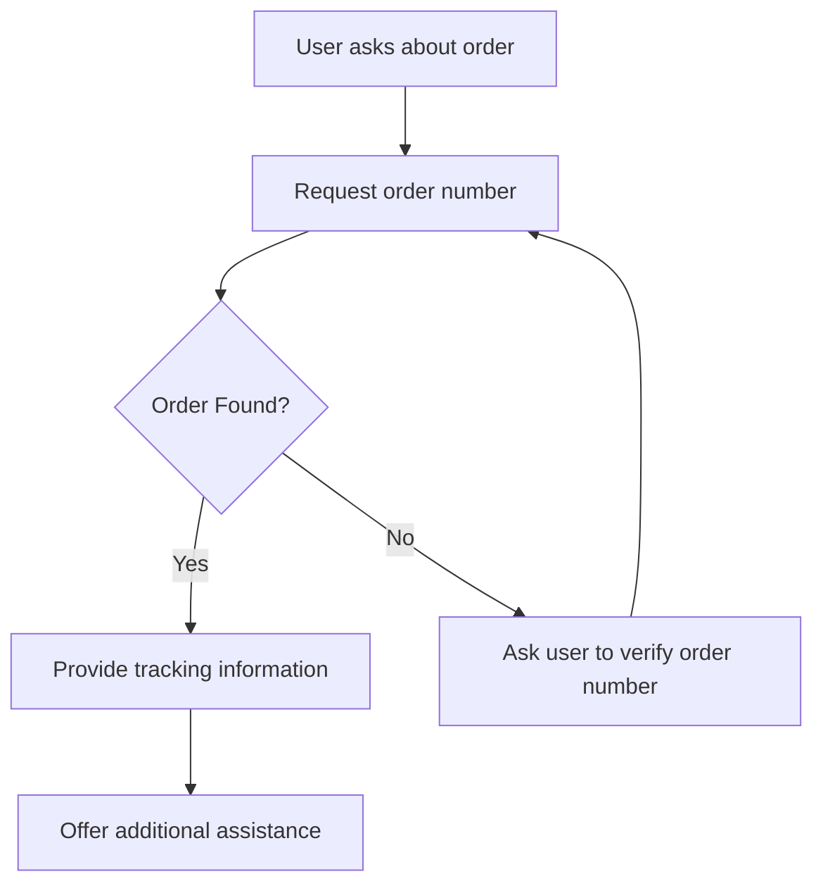
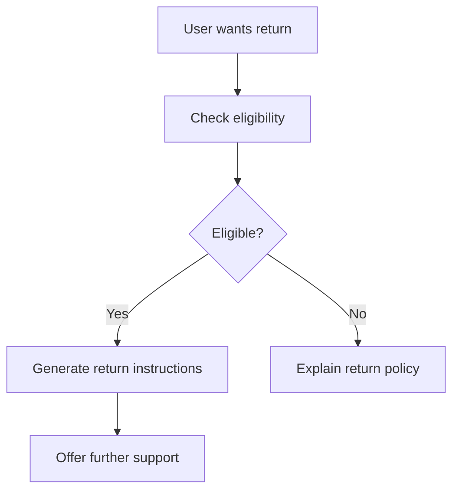
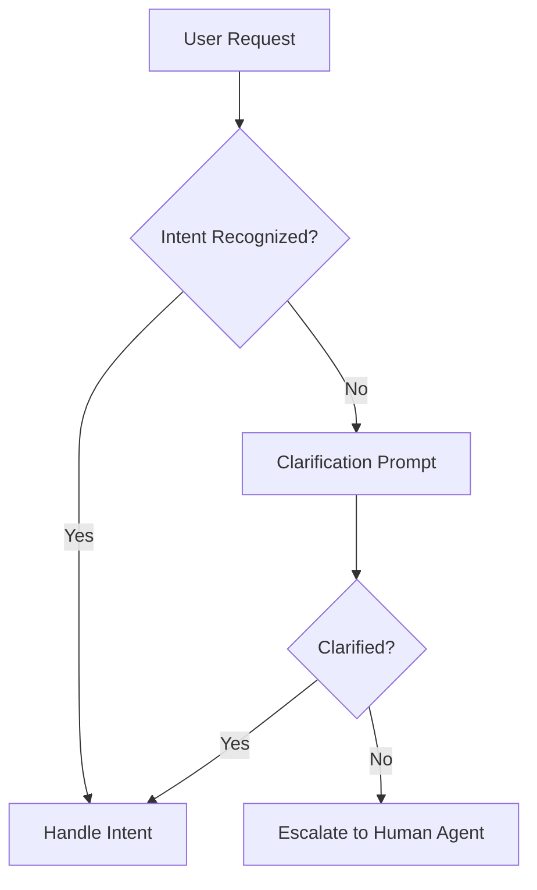

# Conversation Flows

## Order Status Flow

```mermaid
flowchart TD

A[User asks about order] --> B[Request order number]

B --> C{Order Found?}

C -->|Yes| D[Provide tracking information]

C -->|No| E[Ask user to verify order number]

E --> B

D --> F[Offer additional assistance]
```

---

## Return Flow

```mermaid
flowchart TD

A[User wants return] --> B[Check eligibility]

B --> C{Eligible?}

C -->|Yes| D[Generate return instructions]

C -->|No| E[Explain return policy]

D --> F[Offer further support]
```

---

## Escalation Flow

```mermaid
flowchart TD

A[User Request]

A --> B{Intent Recognized?}

B -->|Yes| C[Handle Intent]

B -->|No| D[Clarification Prompt]

D --> E{Clarified?}

E -->|Yes| C

E -->|No| F[Escalate to Human Agent]
```